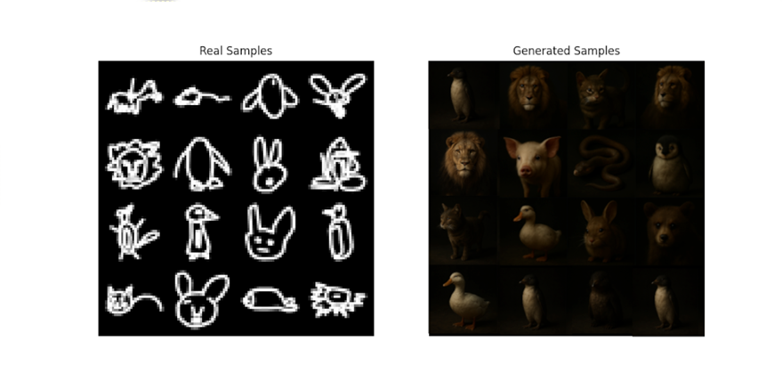

# QuickVAE

**QuickVAE** is a Conditional Variational Autoencoder (CVAE) implementation developed for the **Deep Learning ScuDo Course**.
The model is trained on a subset of the [Quick, Draw!](https://quickdraw.withgoogle.com/data) dataset and is capable of generating recognizable, class-conditioned sketch images.

### 🖼️ Example


> Note: No trained model exists yet, so this image may not represent the final outcome.

### ⚙️ Quickstart

1. Create a virtual environment

    ```bash
    python3 -m venv .venv
    source .venv/bin/activate
    ```
2. Install dependencies

    ```bash
    pip install -r requirements.txt
    ```
    For GPU acceleration on Linux, you can use:

    - `requirements-lin-rocm.txt` → for AMD GPUs
    - `requirements-lin-cuda.txt` → for NVIDIA GPUs

    > Note: NVIDIA GPU acceleration works on Windows 11 using WSL2.

3. Start the script
    ```bash
    python3 main.py
    ```

The training script will:
- Automatically download the selected QuickDraw classes
- Split the dataset into training and evaluation sets
- Train the Conditional VAE model
- Plot and save learning curves
- Generate sample images conditioned on real classes
- Save the best model checkpoint based on evaluation loss

During training, you can cancel the training by pressing `Ctrl+c`.
To resume, you can simply restart the main script. Some figures may be overwritten.

### ⏹️ Interrupt & Resume

You can safely stop training anytime with Ctrl+C.
To resume training, simply restart the script:

```bash
python3 main.py
```

The script will automatically load the latest checkpoint and continue.
> Note: Some generated sample images and plots may be overwritten when resuming training.